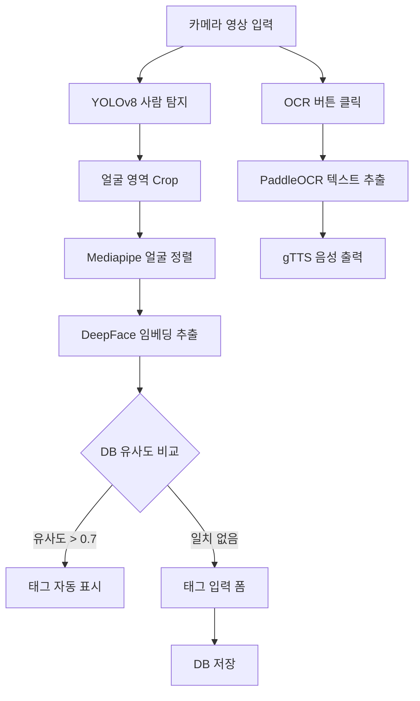
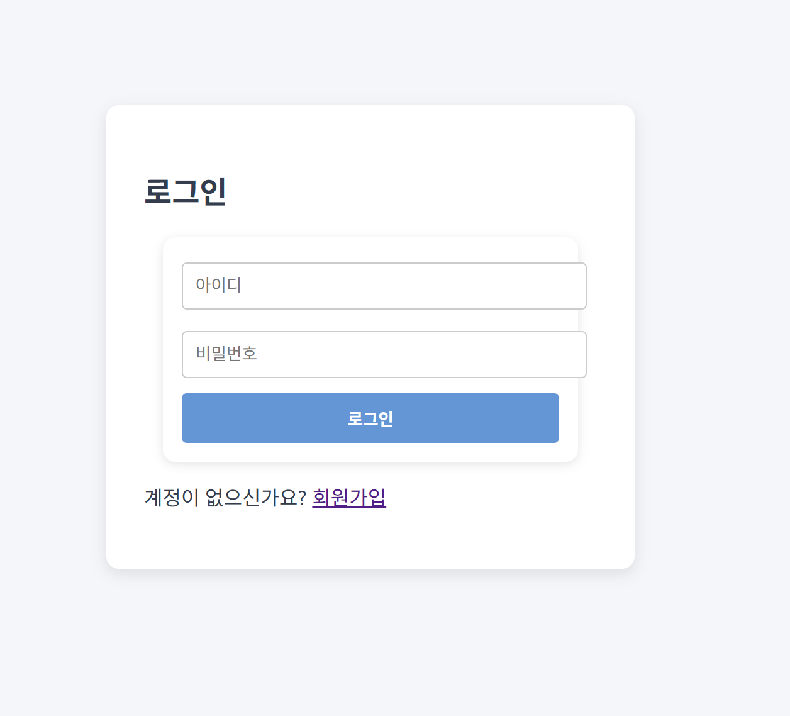
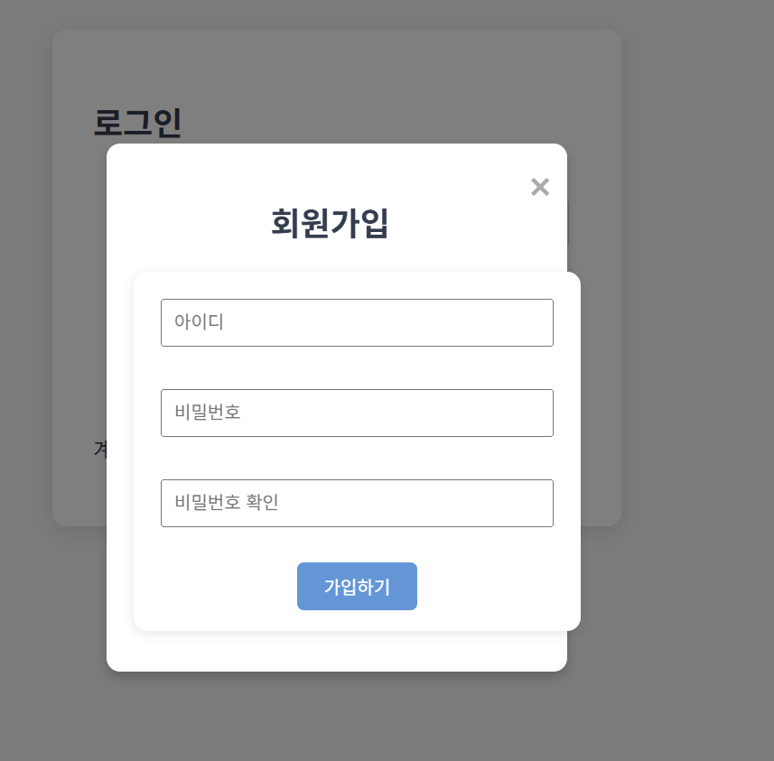
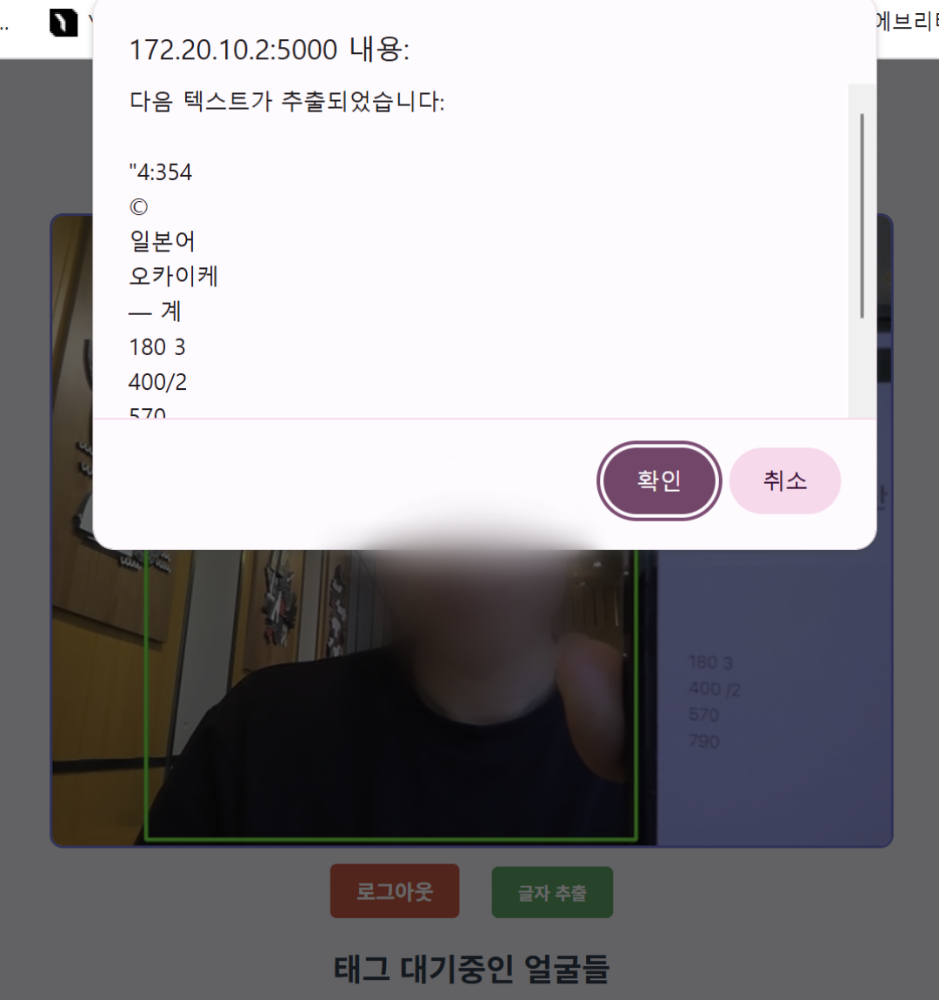

# 👁️ 시각 약자를 위한 실시간 얼굴 인식 보조 시스템

[](https://python.org)
[](https://flask.palletsprojects.com)
[](https://ultralytics.com)
[](https://github.com/serengil/deepface)
[](LICENSE)

> **Python Flask 기반 웹 애플리케이션**으로, 실시간 영상에서 YOLOv8로 인물을 탐지하고 DeepFace를 통해 얼굴을 인식하여 자동 분류하는 **AI 기반 보조 시스템**입니다.

<p align="center">
  
</p>

---

## 🎯 프로젝트 개요

| 항목 | 내용 |
|------|------|
| **프로젝트 기간** | 2025.04 ~ 2025.09 (6개월) |
| **프로젝트 유형** | 개인 프로젝트 |
| **주요 목표** | 시각 약자가 주변 인물을 쉽게 인식할 수 있도록 돕는 AI 보조 시스템 개발 |
| **핵심 기술** | Computer Vision, Face Recognition, OCR, TTS |

### 📌 해결하고자 한 문제
- 시각 장애인이 주변 사람을 인식하기 어려운 문제
- 실시간으로 인물을 구분하고 음성으로 안내받을 필요성
- 텍스트 정보를 읽기 어려운 상황에서의 OCR + TTS 지원

---

## ✨ 주요 기능

### 1️⃣ 실시간 얼굴 탐지 및 인식
- **YOLOv8 커스텀 모델**로 사람 탐지 (`best.pt`)
- **Mediapipe**로 얼굴 정렬 → 인식 정확도 향상
- **DeepFace (Facenet)**로 512차원 얼굴 임베딩 추출
- **Cosine Similarity**로 기존 인물과 유사도 비교 (threshold: 0.7)

### 2️⃣ 자동 분류 및 태깅
- 등록된 인물 → 자동으로 이름 태그 표시
- 미등록 인물 → 태그 입력 폼 생성, 카테고리와 함께 DB 저장

### 3️⃣ OCR + 음성 출력
- **PaddleOCR**로 화면 내 텍스트 추출
- **gTTS**로 추출된 텍스트를 음성으로 출력

### 4️⃣ 웹 기반 인터페이스
- PC 및 모바일 브라우저 대응 반응형 UI
- 세션 기반 로그인/회원가입 시스템
- 실시간 영상 스트리밍 (OpenCV + Flask)

---

## 🛠️ 기술 스택

### Backend
| 기술 | 용도 |
|------|------|
| **Python 3.9** | 메인 개발 언어 |
| **Flask** | 웹 프레임워크 |
| **OpenCV** | 영상 처리 및 스트리밍 |
| **MariaDB** | 사용자/얼굴 데이터 저장 |

### AI/ML
| 기술 | 용도 |
|------|------|
| **YOLOv8 (Ultralytics)** | 객체 탐지 (사람 검출) |
| **DeepFace + Facenet** | 얼굴 임베딩 및 인식 |
| **Mediapipe** | 얼굴 랜드마크 검출 및 정렬 |
| **PaddleOCR** | 텍스트 인식 |
| **gTTS** | 텍스트 음성 변환 |

### Frontend
| 기술 | 용도 |
|------|------|
| **HTML/CSS/JavaScript** | UI 구현 |
| **PIL + Malgun.ttf** | 한글 폰트 렌더링 |

---

## 📁 프로젝트 구조

```
📁 Tracking_Project/
├── 📄 main.py                  # Flask 앱 실행 + 영상 처리 메인 로직
├── 📄 login.py                 # 로그인, 회원가입 처리
├── 📄 database.py              # DB 연결 및 임베딩 CRUD
├── 📄 OCR_Paddle_module.py     # PaddleOCR 텍스트 추출 함수
├── 📄 requirements.txt         # Python 의존성
├── 🤖 best.pt                  # YOLOv8 커스텀 학습 모델
├── 🤖 yolov8n.pt               # YOLOv8n 기본 모델 (백업)
│
├── 📁 templates/
│   ├── index.html              # 메인 태깅 화면
│   └── register.html           # 회원가입 화면
│
├── 📁 static/
│   ├── styles.css              # 스타일시트
│   ├── main.js                 # 태깅 폼 처리 및 OCR 실행
│   ├── register_modal.js       # 회원가입 모달 제어
│   └── 📁 fonts/
│       └── malgun.ttf          # 한글 폰트
│
└── 📁 images/                  # README 이미지
```

---

## ⚙️ 시스템 아키텍처

<p align="center">
  
</p>

### 처리 흐름



---

## 🚀 실행 방법

### 1. 환경 설정

```bash
# 레포지토리 클론
git clone https://github.com/jjkkhh123/Tracking_Project.git
cd Tracking_Project

# 가상환경 생성 (Conda 권장)
conda create -n trackingpj python=3.9
conda activate trackingpj

# 의존성 설치
pip install -r requirements.txt
```

### 2. 데이터베이스 설정

```sql
CREATE DATABASE tagpj;
USE tagpj;

-- 사용자 테이블
CREATE TABLE users (
    id INT AUTO_INCREMENT PRIMARY KEY,
    username VARCHAR(255) NOT NULL,
    password VARCHAR(255) NOT NULL
);

-- 얼굴 임베딩 테이블
CREATE TABLE known_faces (
    id INT AUTO_INCREMENT PRIMARY KEY,
    tag VARCHAR(255) NOT NULL,
    category VARCHAR(255),
    embedding TEXT NOT NULL,
    user_id INT,
    FOREIGN KEY (user_id) REFERENCES users(id)
);
```

### 3. 실행

```bash
python main.py
```

실행 후 콘솔 출력:
```
🌐 접속 주소:
 - http://127.0.0.1:5000      (로컬)
 - http://192.168.X.X:5000    (모바일 접근 가능)
```

---

## 📸 구현 화면

| 로그인 | 회원가입 |
|--------|----------|
|  |  |

| 메인 화면 | OCR 기능 |
|-----------|----------|
|  |  |

---

## 📊 성능 및 결과

| 지표 | 결과 |
|------|------|
| 얼굴 인식 정확도 | 약 85% (유사도 threshold 0.7 기준) |
| 실시간 처리 속도 | ~15 FPS (RTX 3060 기준) |
| OCR 인식률 | 한글/영문 혼합 텍스트 약 90% |

---

## 💡 확장 가능성

본 프로젝트를 기반으로 다음과 같은 확장이 가능합니다:

| 확장 방향 | 설명 |
|----------|------|
| **다중 얼굴 최적화** | 동시 다수 인물 인식 성능 개선 |
| **Edge 디바이스 배포** | Raspberry Pi, Jetson Nano 등 경량화 |
| **음성 인터페이스** | 음성 명령으로 시스템 제어 |
| **모바일 앱 개발** | React Native 기반 크로스플랫폼 앱 |
| **클라우드 연동** | AWS/GCP 기반 얼굴 데이터 동기화 |

---

## 📚 참고 자료

- [Ultralytics YOLOv8](https://github.com/ultralytics/ultralytics)
- [DeepFace](https://github.com/serengil/deepface)
- [PaddleOCR](https://github.com/PaddlePaddle/PaddleOCR)
- [OCR 관련 자료](https://github.com/SeonminKim1/Study-OCR)

---

## 📄 라이선스

MIT License - 자유롭게 사용, 수정, 배포 가능합니다.

---

## 👤 개발자

**이진수** | [GitHub](https://github.com/jjkkhh123) | [Portfolio](https://jjkkhh123.github.io/profile/)
